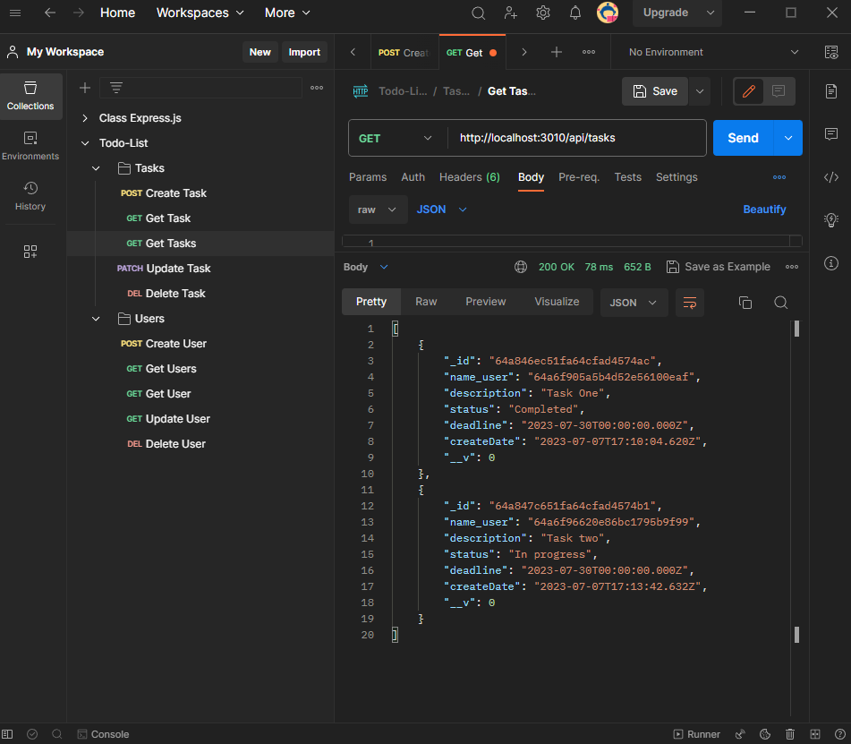
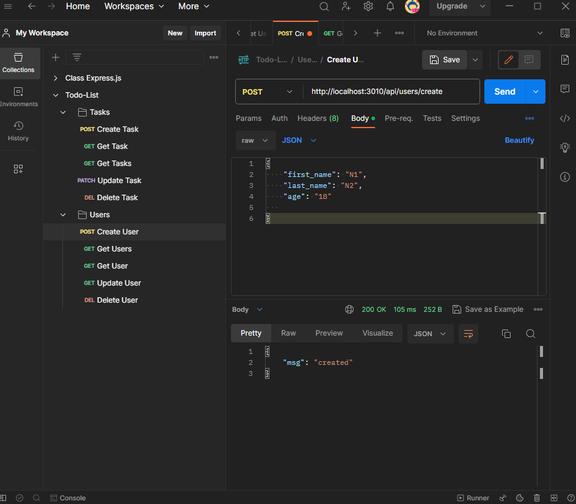
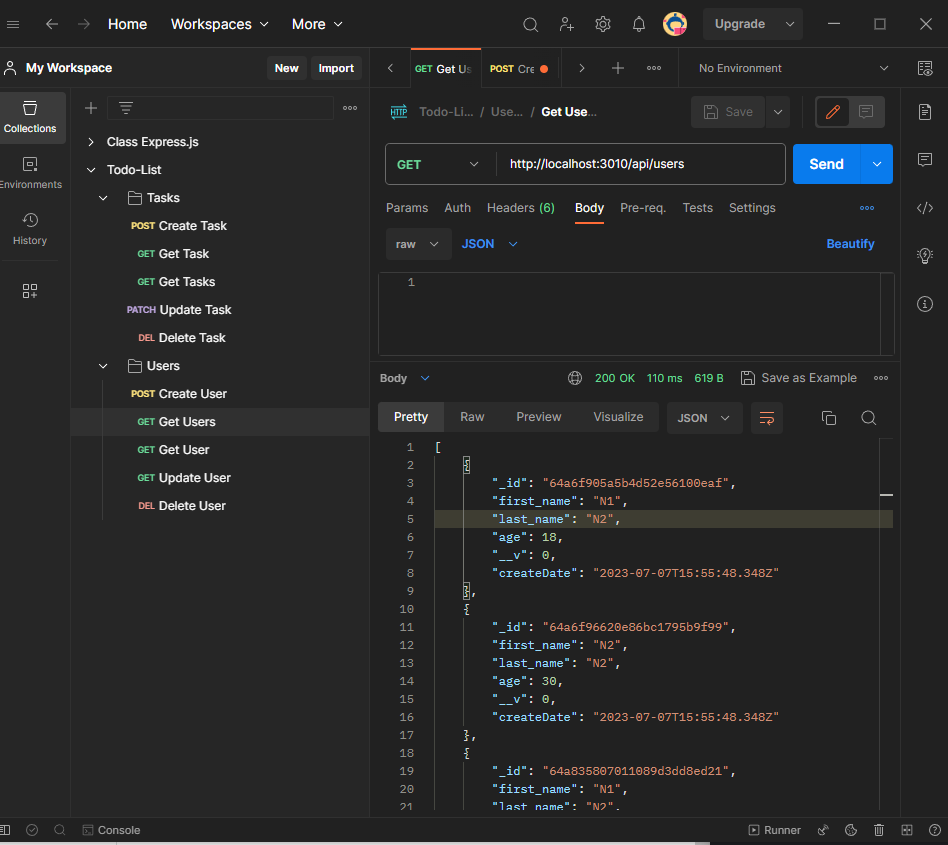
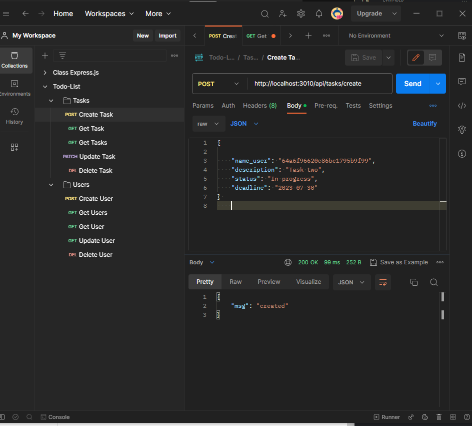
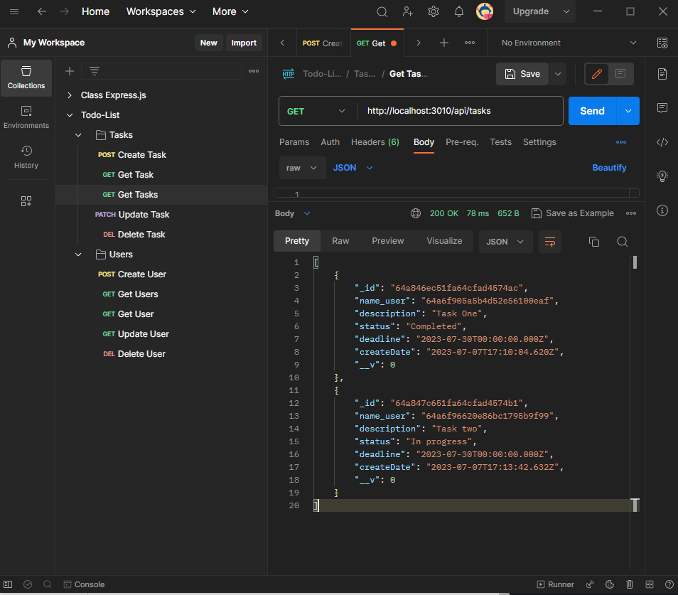

### To-Do-List
This is an API REST for a To-Do List that allows adding, updating, get and delete tasks and users.
                        
      
## Users
# Create a User
    Method: POST
    Route: /api/users
    Request Body Parameters:
        • firstName (string): Nane of the user.
        • lastName (string): Last nameof the user.
        • age (number): Age of the user.
                        
                        

# Get all Users
    Method: GET
    Ruta: /api/users
                        
# Get a specific User
    Method: GET
    Route: /api/users
    Path Parameters:
        • userId (string): Unique identifier of the user.

# Update a User
    Method: PATCH
    Route: /api/users/{userId}
    Path Parameters:
        • userId (string): Unique identifier of the user to update.
    Request Body Parameters (at least one of the following):
        • firstName (string): New name of the user
        • lastName (string): New last name of the user.
        • age (number): New age of the user.

# Delete a User
    Method: DELETE
    Route: /api/users/{userId}
    Path Parameters:
        • userId (string): Unique identifier of the user to delete.

## Tasks
# Create a Task
    Method: POST
    Route: /api/tasks
    Request Body Parameters:
        • userId (string): Unique identifier of the user the task belongs to..
        • description (string): Description of the task.
        • status (string): Status of the task.
        • deadline (string): Deadline of the task (format: YYYY-MM-DD).
        • createDate (string): Creation date of the task (format: YYYY-MM-DD).

                            

# Get all Tasks
    Method: GET
    Route: /api/tasks
                            

# Get a specific Task
    Method: GET
    Route: /api/tasks/{taskId}
    Path Parameters:
        • taskId (string): Unique identifier of the task.

# Update a Task
    Method: PATCH
    Route: /api/tasks/{taskId}
    Path Parameters:
        • taskId (string): Unique identifier of the task to update.
    Request Body Parameters (at least one of the following):
        • userId (string): New identifier of the user the task belongs to.
        • description (string): New description of the task.
        • status (string): New status of the task
        • deadline (string): New deadline of the task (format: YYYY-MM-DD).
        • createDate (string): New creation date of the task (format: YYYY-MM-DD).

# Delete a Task
    Method: DELETE
    Route: /api/tasks/{taskId}
    Path Parameters:
        • taskId (string): Unique identifier of the task to delete.
   